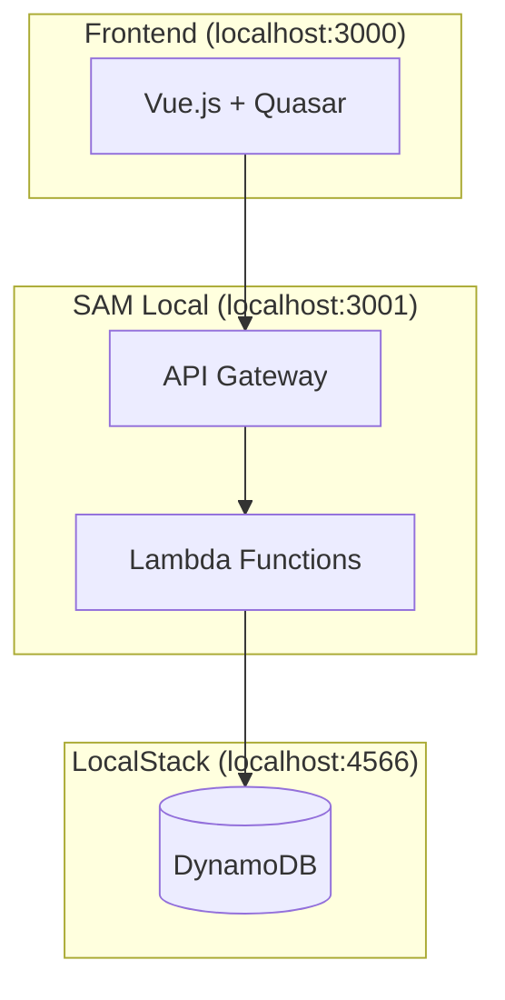
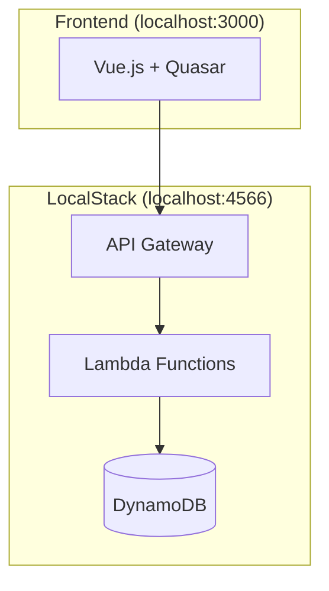
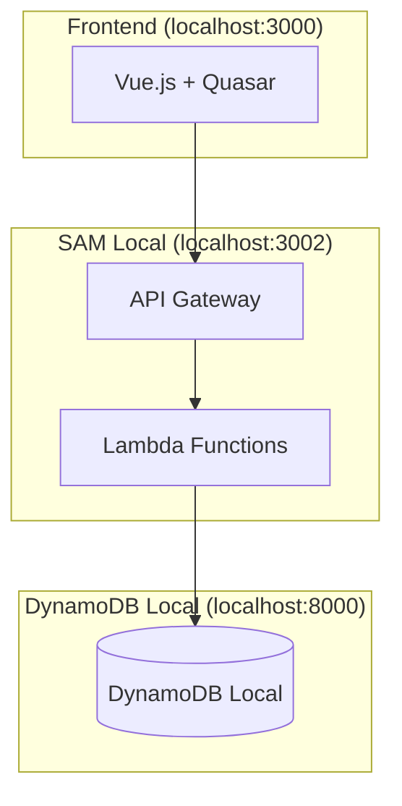

# ローカル開発環境のアーキテクチャ比較

## 概要

Todo アプリケーションのローカル開発環境では、以下3つのアーキテクチャパターンが利用可能です。

## 1. 現在の構成: SAM Local + LocalStack DynamoDB (Hybrid)

### 構成図


### 特徴
- **API Gateway + Lambda**: SAM Local で実行
- **DynamoDB**: LocalStack で実行  
- **接続**: Lambda → LocalStack DynamoDB (host.docker.internal:4566)

### メリット
- AWS SAM の本格的なローカル環境
- LocalStack の豊富なAWSサービス対応
- 本番環境との高い互換性

### デメリット
- 複数サービスの管理が必要
- Docker ネットワーク設定が複雑
- リソース使用量が多い

### 起動コマンド
```bash
# LocalStack起動
make localstack-up

# SAM Local起動
make backend-start

# フロントエンド起動
make frontend-start
```

## 2. Alternative 1: Complete LocalStack (All-in-One)

### 構成図


### 特徴
- **全てのAWSサービス**: LocalStack で一元実行
- **統一エンドポイント**: localhost:4566

### メリット
- 設定が最もシンプル
- 全サービスが同一環境
- Docker Compose だけで完結

### デメリット
- LocalStack Pro の機能が必要（一部制限あり）
- デバッグが困難
- SAM の恩恵を受けられない

### 実装方法
```bash
# deploy-localstack.sh を使用
./deploy-localstack.sh
```

## 3. Alternative 2: Pure SAM Local + DynamoDB Local

### 構成図


### 特徴
- **API Gateway + Lambda**: SAM Local で実行
- **DynamoDB**: DynamoDB Local (公式) で実行
- **接続**: Lambda → DynamoDB Local (localhost:8000)

### メリット
- AWS公式ツールのみ使用
- 軽量で高速
- SAM の全機能が利用可能
- デバッグが容易

### デメリット
- DynamoDB 以外のAWSサービスは別途必要
- 手動設定が多い

### 起動コマンド
```bash
# DynamoDB Local起動
./start-dynamodb-local.sh

# SAM Local起動 (DynamoDB Local用設定)
sam local start-api --port 3002 --env-vars env-dynamodb-local.json

# フロントエンド起動
make frontend-start
```

## パフォーマンス比較

| 項目 | Hybrid | Complete LocalStack | Pure SAM Local |
|------|--------|-------------------|-----------------|
| 起動時間 | 中 | 長 | 短 |
| メモリ使用量 | 中 | 高 | 低 |
| デバッグ容易さ | 中 | 低 | 高 |
| 本番互換性 | 高 | 高 | 高 |

## 開発段階別推奨構成

### 1. 開発初期 (機能実装)
**推奨**: Pure SAM Local + DynamoDB Local
- 高速起動とデバッグ重視

### 2. 統合テスト
**推奨**: Hybrid (現在の構成)
- バランスの取れた環境

### 3. 本番前検証
**推奨**: Complete LocalStack
- 本番環境に最も近い構成

## まとめ

現在の **Hybrid 構成** は、開発効率と本番互換性のバランスが良く、継続使用を推奨します。

ただし、用途に応じて他の構成も選択可能で、特に開発初期段階では **Pure SAM Local** を、本番前の最終確認では **Complete LocalStack** を使い分けることで、より効率的な開発が可能です。