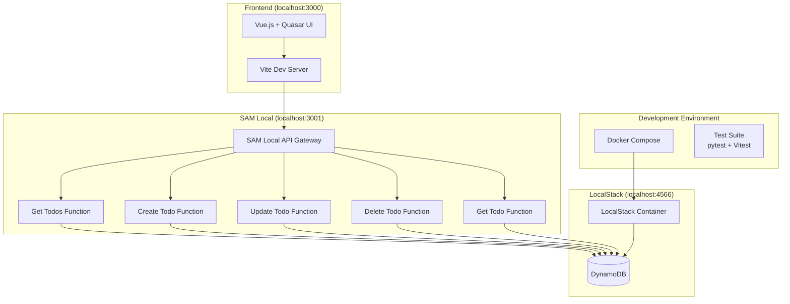
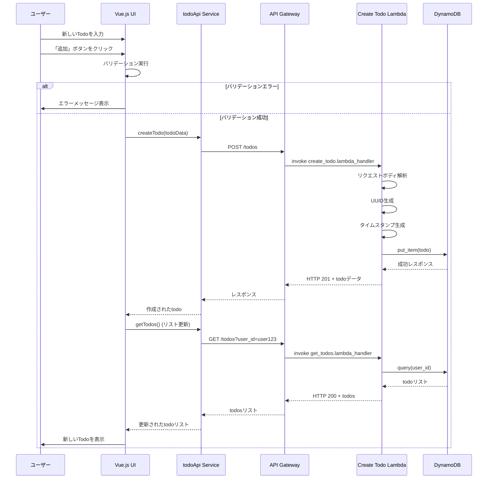
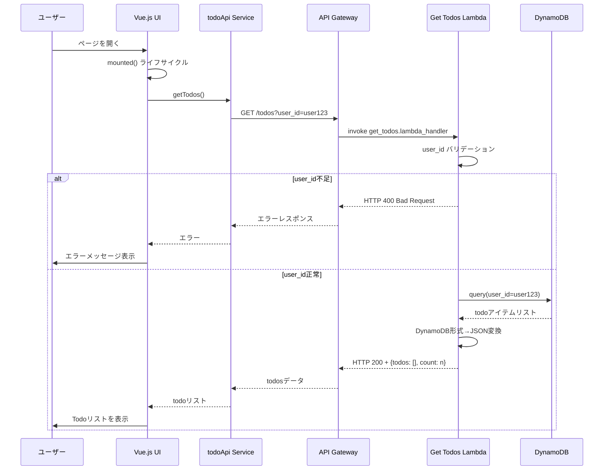
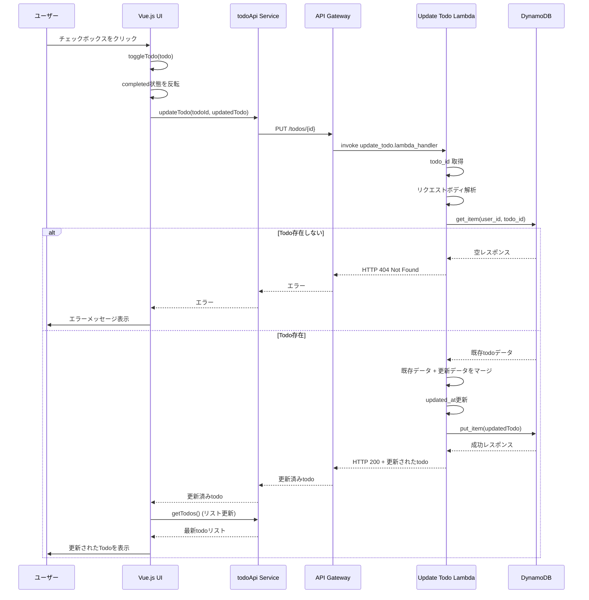
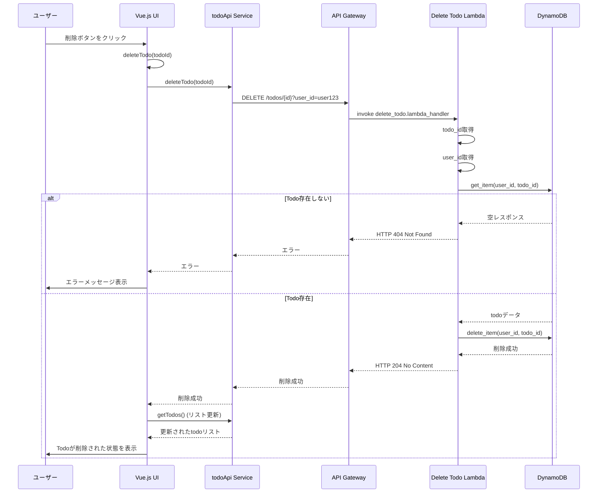
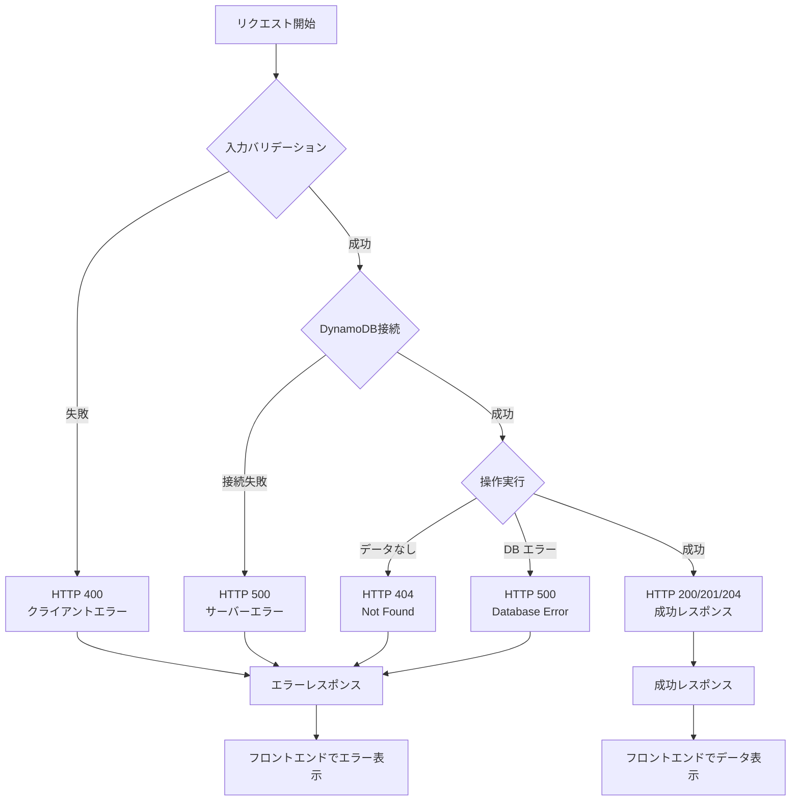
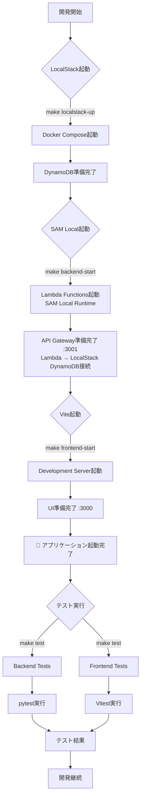
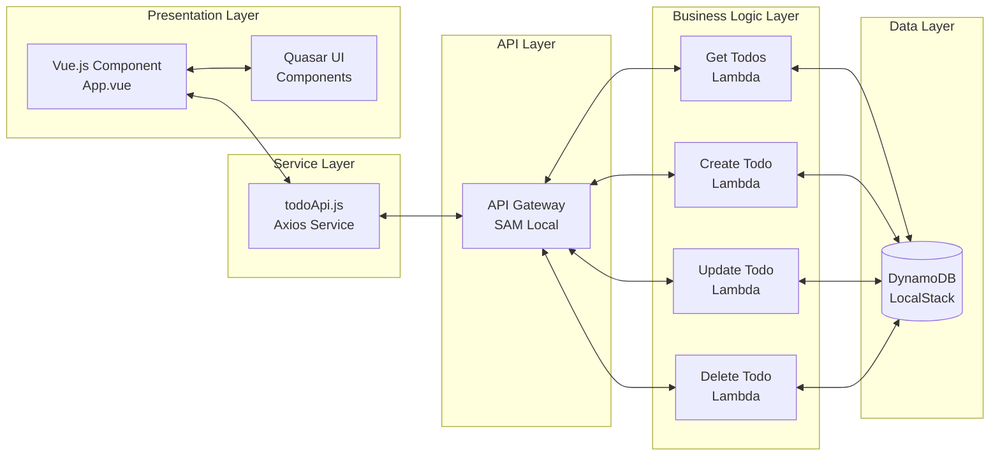
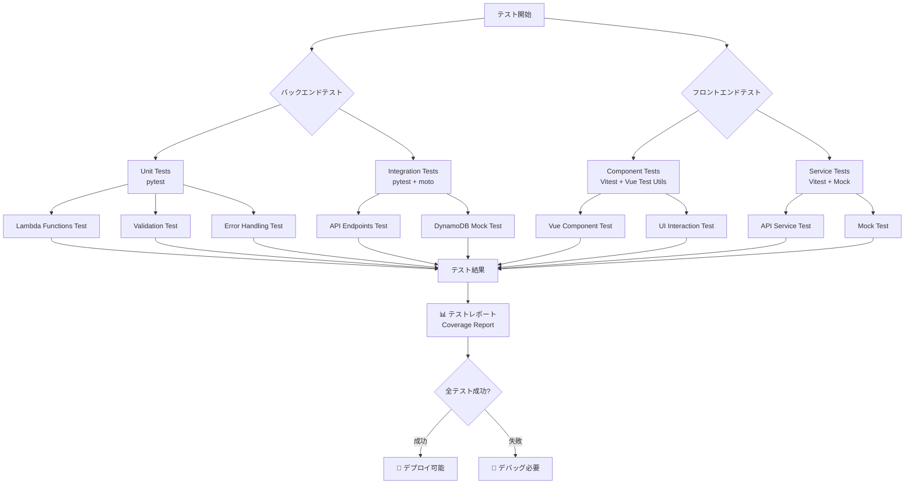

# Todo アプリケーション動作フロー

## ローカル開発環境の構成

**重要**: ローカル環境では以下の分離された構成になっています：

- **SAM Local (localhost:3001)**: API Gateway + Lambda Runtime 
- **LocalStack (localhost:4566)**: DynamoDB のみ
- **接続**: Lambda関数が LocalStack の DynamoDB に接続

## システム全体構成図

## Todo作成フロー

## Todo取得フロー

## Todo更新フロー（完了切り替え）

## Todo削除フロー

## エラーハンドリングフロー

## 開発環境起動フロー

## データフロー図

## テスト実行フロー

